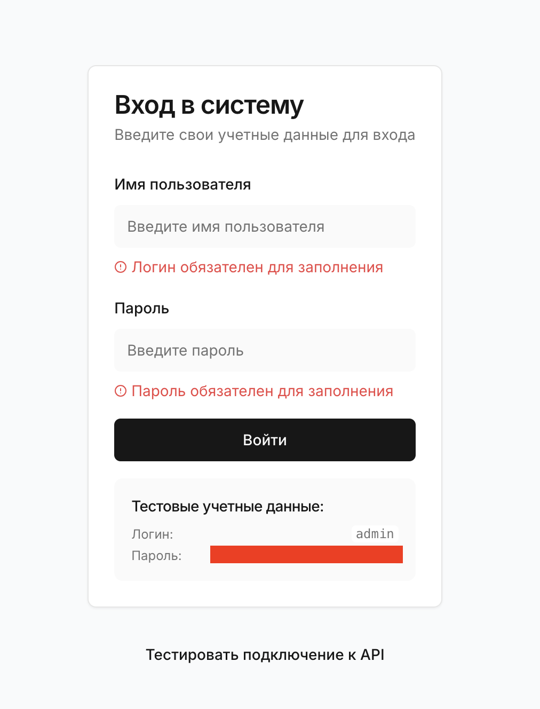
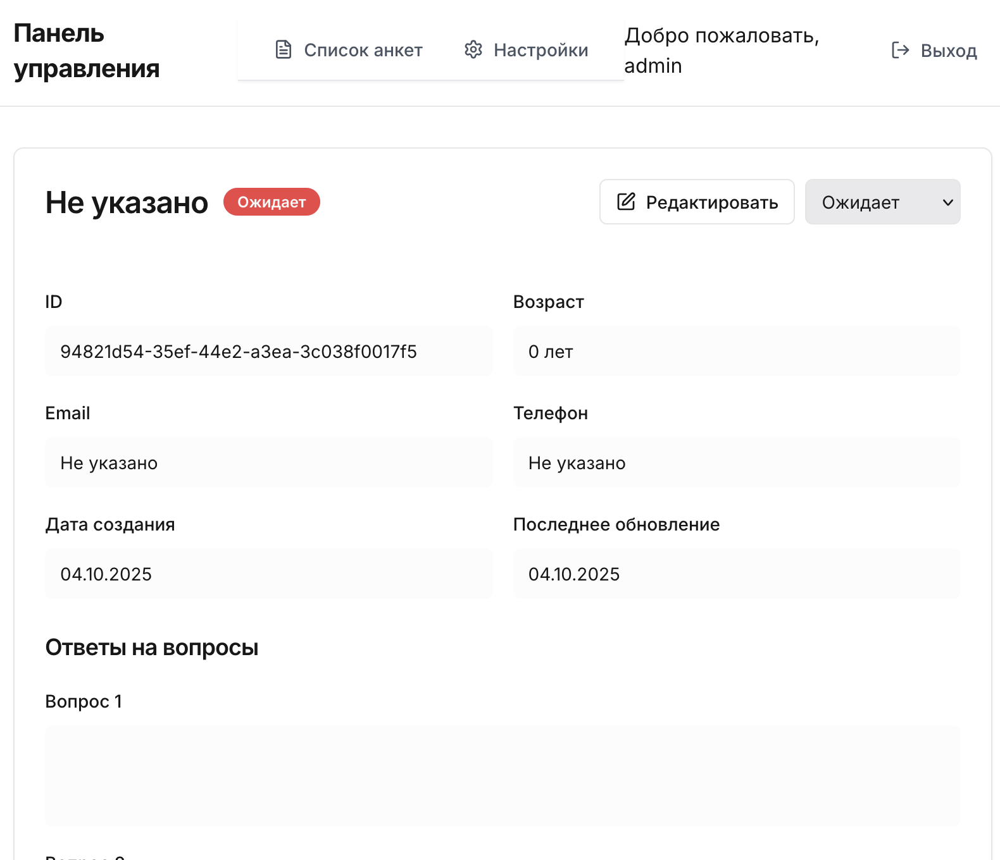
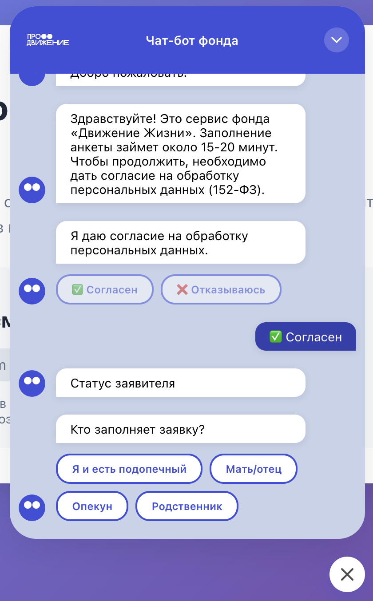
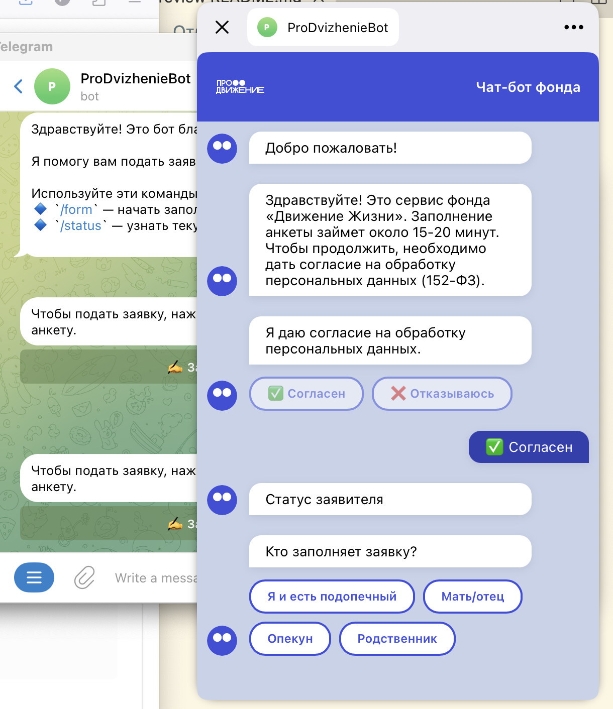

# Чат-бот для Благотворительный фонд «Продвижение»

> Проект разработан в рамках хакатона Мастерской Яндекс Практикума

## 📅 О хакатоне

**Даты проведения:** 23 сентября – 3 октября 2025 года

**Цель:** Разработать чатбота согласно [техническому заданию](./tz.md)

**Заказчик:** Благотворительный фонд «Продвижение»

## 👥 Команда

Наша команда:

- **Менеджмент:**
    - Менеджер продукта: [Петраков Олег](https://github.com/IkeMurami/)
    - Менеджер проекта: [Добронравов Сергей](https://github.com/serdobro/) 
- **Разработка:**
    - Руководитель фронтенд разработки: [Жмакина Юлия](https://github.com/yunminiature)
    - Фронтенд-разработчик: [Фищук Алексей](https://github.com/fishouk)
    - Фронтенд-разработчик: [Панагушин Сергей](https://github.com/Sergey-Panagushin)
    - Руководитель бекенд разработки: [Королев Владимир](https://github.com/VOVSn)
- **Дизайн:**
    - [Майорова Светлана](https://t.me/samayorova)
    - [Кожаева Кристина](https://t.me/urfreakk)
    - [Иванова Анастасия](https://t.me/creator_aa)

## 🛠 Стек технологий

### Frontend

Чатбот:

- React
- Typescript

Админ-панель:

- React
- Typescript
- [Ant Design](https://ant.design/)

### Backend

- Python
- FastAPI
- Aiogram

### Инфраструктура

- Yandex Cloud
- Terraform
- Nginx

## 📦 Компоненты проекта

| Компонент | Описание | Репозиторий |
|-----------|----------|-------------|
| **Админ-панель** | Интерфейс управления заявками и чатботом | [🔗 Ссылка](https://github.com/ProDvizhenieChatBot/dvizhenie-life-frontend) |
| **Backend API** | Серверная часть админ-панели и чатбота | [🔗 Ссылка](https://github.com/ProDvizhenieChatBot/dvizhenie-microservices-backend) |
| **Виджет чатбота** | Клиентский виджет для интеграции на сайт и в телеграм | [🔗 Ссылка](https://github.com/ProDvizhenieChatBot/dvizhenie-chat-widget) |
| **Скрипты деплоя** | Автоматизация развертывания | [🔗 Ссылка](https://github.com/ProDvizhenieChatBot/dvizhenie-deploy) |

## 🚀 Быстрый старт

[Смотри](https://github.com/ProDvizhenieChatBot/dvizhenie-deploy) скрипт развертывания

## 📝 Документация

Отдельную документацию по компонентам можно найти в каждом репозитории в readme-файлах

## Продуктовая аналитика

Ознакомиться с продуктовой аналитикой можно по [ссылке](./product.md).

## Дизайн

Figma: [🔗 Ссылка](https://www.figma.com/design/Uov5DE8NXLw3TazuMe5oXk/%D0%9F%D1%80%D0%BE%D0%B4%D0%B2%D0%B8%D0%B6%D0%B5%D0%BD%D0%B8%D0%B5--Copy-?t=pNZO7nsISEUhlyhf-0)

### Админ-панель

  
  

### Виджет чатбота

  
  

